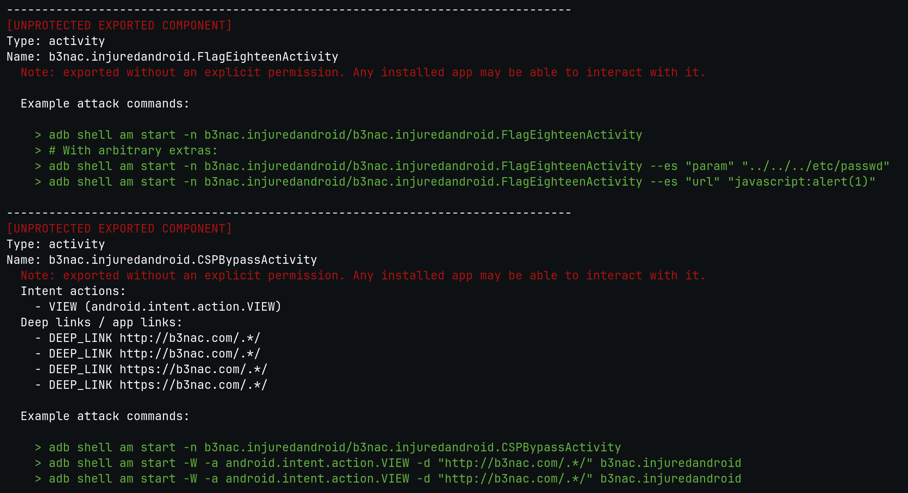
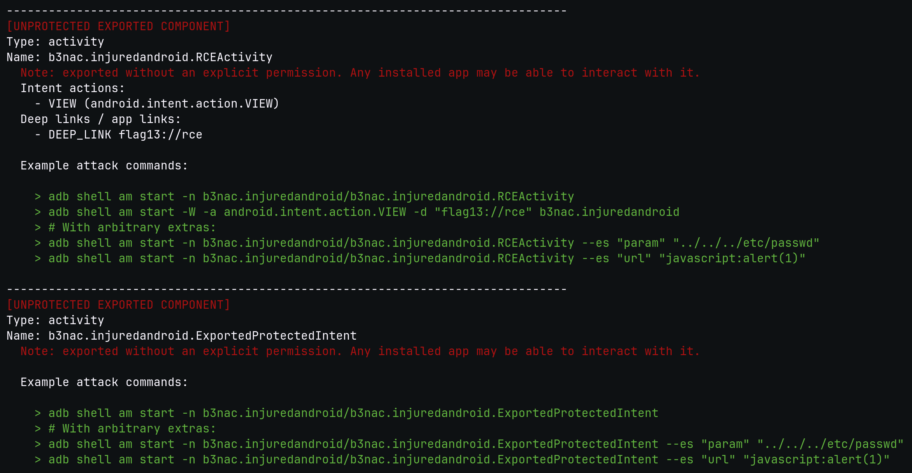
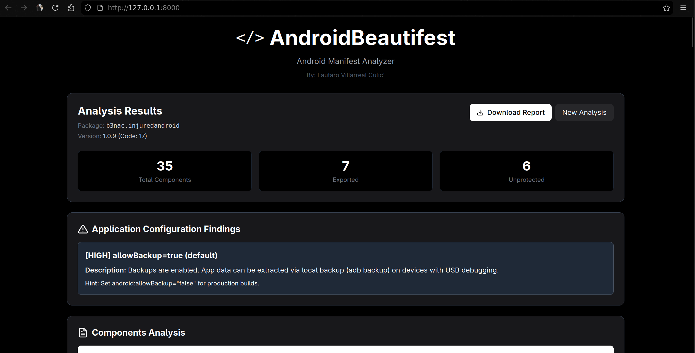
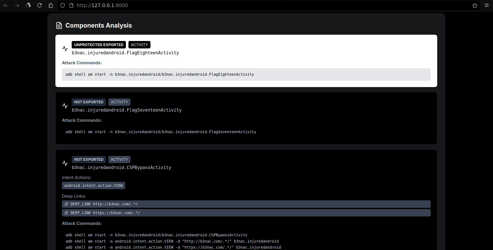
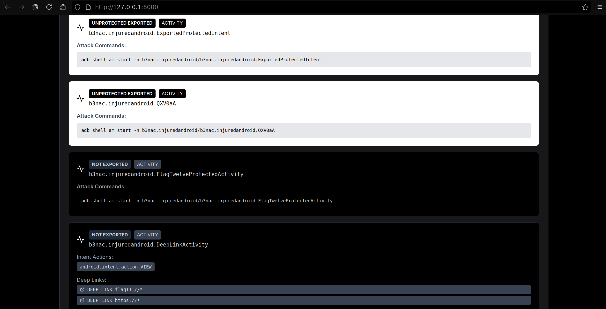

# AndroidBeautifest

**AndroidBeautifest** is a manifest-based static analyzer for Android APKs.
It extracts *exported components*, *deep links*, and *dangerous configurations*, generating ready-to-use ADB attack commands (check code for adjustment).

# Screenshots
## CLI




## Web UI




# Features
- Parses AndroidManifest.xml directly using Androguard.
- Detects exported/unprotected components.
- Identifies debuggable, allowBackup, and cleartext traffic settings.
- Generates ADB commands for each component.
- FastAPI backend + minimal React/Tailwind frontend.
- No APKs or data stored (memory-only analysis).
- CLI version.

# Usage
## Web
1. Install dependencies
```bash
pip3 install fastapi uvicorn androguard
```
2. Run the backend
```bash
python3 server.py
```
3. Open the web UI
```bash
http://localhost:8000/
```
Upload an .apk and view its manifest analysis in real time.
## CLI
1. Install dependencies
```bash
pip3 install fastapi uvicorn androguard
```
2. Run the command
```bash
python3 androidBeautifest.py <name>.apk
```
